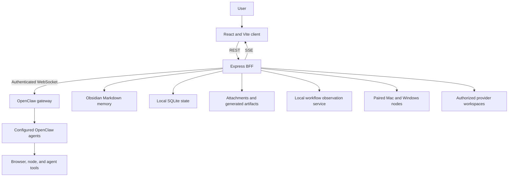
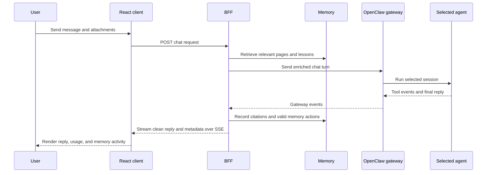
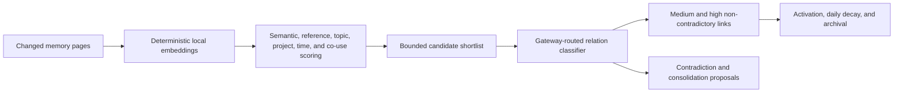
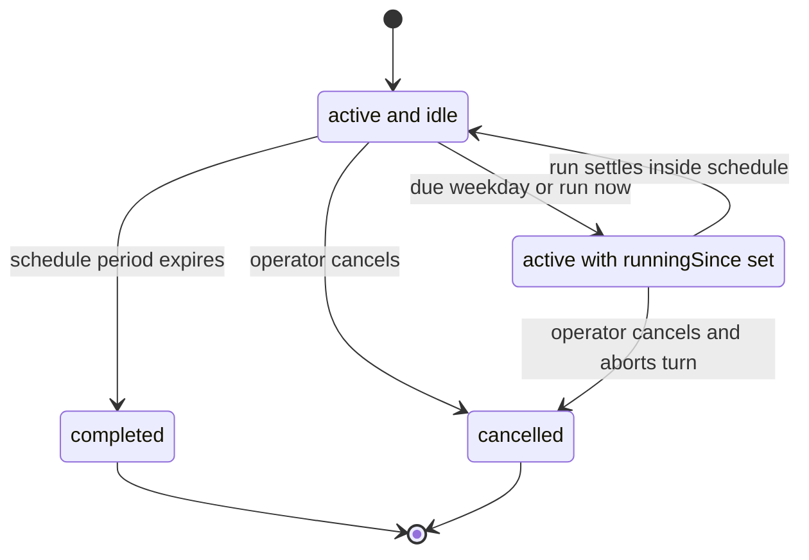
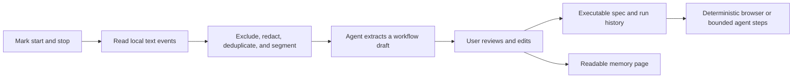
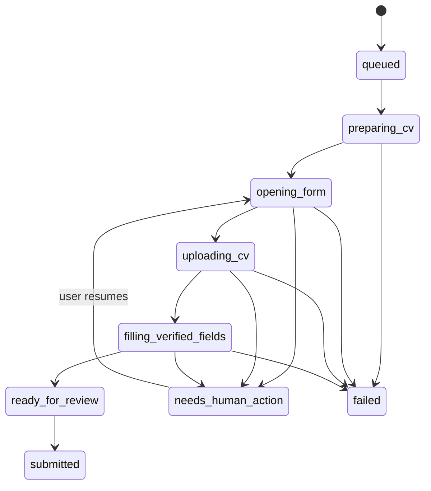

# ORION

ORION is a personal AI operating system built around an OpenClaw deployment. It brings agent sessions, memory-backed chat, workflow learning, authorized data extraction, job-application assistance, node control, screen mirroring, and usage reporting into one React control center.

The project demonstrates how to turn capable AI agents into a usable, stateful product: a React and TypeScript interface, an Express backend-for-frontend, WebSocket gateway integration, SQLite persistence, Obsidian-backed memory, neural relationship processing, browser workflows, human approval gates, and defensive access controls.

This public repository is a technical portfolio of the ORION project for recruiters and other technical reviewers. It includes the application architecture, frontend, backend, persistence, agent orchestration, safety controls, tests, and documentation needed to understand how the system works.


## Why this project is worth reviewing

ORION is more than a chat screen. It connects model-driven reasoning to persistent state, real tools, local devices, and reviewable workflows while keeping sensitive actions behind explicit boundaries.

- **Agent orchestration:** manages sessions, models, execution targets, gateway events, retries, cancellation, and usage attribution.
- **A compounding Second Brain:** stores approved memories and shared lessons, then retrieves them in later work so agents can learn from reviewed mistakes and improve future decisions without retraining the model.
- **Human-controlled automation:** learns workflows from redacted observations, replays deterministic browser steps, and pauses before actions such as submitting, publishing, paying, deleting, or sharing.
- **Production-minded boundaries:** keeps credentials in the backend, isolates sensitive workspaces, validates filesystem paths, limits node actions, records state transitions, and requires authentication for private areas.
- **A working portfolio project:** the job-application flow has completed three applications end to end, while the README documents where broader site compatibility still needs work.

> [!IMPORTANT]
> This is an early-stage application for a trusted local environment. Several integrations are optional, and some workflows depend on services that this repository does not install or configure.

> [!NOTE]
> Extraction is restricted to systems and data sources you are authorized to access. Public source uses neutral provider IDs; real endpoints, schemas, profiles, and target mappings belong in private deployment configuration.

## Public portfolio scope and redactions

This is the real ORION codebase with narrowly scoped security and privacy redactions. The project intentionally omits credentials, local environment values, personal documents and runtime data, machine-specific paths, and private integration details such as real provider identities, endpoints, schemas, browser profiles, and target mappings. Those omissions protect private services and data; they are not placeholders for the core application.

The implementation behind the product remains available to inspect: the React interface, Express BFF, OpenClaw gateway integration, agent and session orchestration, Second Brain and neural-memory logic, workflow learning, extraction scheduling and output handling, Hunting workflows, node and screen controls, persistence model, security boundaries, and automated tests. Neutral provider adapters show the integration boundary and normalized data flow without exposing a third party's private or operational contract.

## Contents

- [Capabilities](#capabilities)
- [Public portfolio scope and redactions](#public-portfolio-scope-and-redactions)
- [Architecture](#architecture)
- [Technology stack](#technology-stack)
- [Repository structure](#repository-structure)
- [Core request flow](#core-request-flow)
- [Agent architecture](#agent-architecture)
- [Memory and knowledge](#memory-and-knowledge)
- [Authorized extraction](#authorized-extraction)
- [Workflow learning](#workflow-learning)
- [Hunting workspace](#hunting-workspace)
- [Nodes, screens, and usage](#nodes-screens-and-usage)
- [API and event model](#api-and-event-model)
- [Persistence](#persistence)
- [Configuration](#configuration)
- [Local setup](#local-setup)
- [Running ORION](#running-orion)
- [Security](#security)
- [Testing](#testing)
- [Troubleshooting](#troubleshooting)
- [Known limitations](#known-limitations)
- [Contributing](#contributing)

## Capabilities

| Area | Implemented behavior |
| --- | --- |
| Dashboard | Reports gateway connectivity, active sessions, agent activity, paired nodes, token usage, and estimated cost, behind an animated Orion constellation core whose motion tracks active agent load. |
| Agent Room | Lists agents and sessions supplied by OpenClaw, creates and resets sessions, changes allowed models, shows running or error states, and creates new agents with their own instructions, role, and animated sprite appearance. |
| Chat | Streams replies, carries attachments, selects an execution target, retrieves relevant memory, and reports which memories were used or saved. |
| Second Brain | Reads and writes an Obsidian-backed Markdown wiki, provides search and editing, enforces revision checks, and renders relationships in a Three.js graph. |
| Neural memory | Builds local embeddings, scores candidate relationships, classifies strong candidates, strengthens used links, decays weak automatic links, and proposes consolidations or contradictions for review. |
| Authorized extraction | Creates persisted neutral-provider tasks, runs them on selected weekdays, tracks output files and progress, and supports run windows, pause, resume, stop, preview, and download. |
| Custom extractors | Turns a written brief or an uploaded source folder into a reusable extraction package: WALL-E builds and validates it, Black Noir executes it, and the manifest it produces becomes a selectable option on the task form. |
| Workflow learning | Marks a local observation window, redacts it, produces a reviewable workflow draft, stores the approved recipe, and replays it with confirmation gates. |
| Hunting | Maintains a canonical CV and search profile, discovers roles, prepares application artifacts, fills verified fields, stops for human checkpoints, and records application history. |
| Nodes and screens | Lists paired OpenClaw nodes, removes offline nodes, takes screen snapshots on demand, and supports bounded manual click and scroll control when a node advertises it. |

## Architecture

ORION has three main runtime boundaries:

1. The React client renders the control surface and calls only the BFF.
2. The Express BFF owns credentials, persistence, orchestration state, safety checks, and local service integrations.
3. OpenClaw owns agent definitions, sessions, models, tools, node execution, browser control, and the underlying LLM runs.



### Startup sequence

1. `server/index.js` loads `server/.env` and starts the OpenClaw gateway WebSocket client.
2. The BFF creates the shared SQLite stores, file stores, browser and screen adapters, workflow services, extraction scheduler, custom extractor library, agent profile store, and Hunting services. Any custom extractor build interrupted by a restart is marked failed rather than left building forever.
3. The Obsidian MCP client starts on demand. When available, ORION refreshes the memory cache, creates missing managed instruction pages, links project context, and starts the neural memory engine.
4. Express registers the REST and SSE surfaces. In production mode it also serves `client/dist`.
5. After the server owns its port, it marks interrupted Hunting and extraction work accurately and starts the extraction scheduler.
6. The client polls summary data every 10 seconds and receives gateway, session, chat, memory, and node changes over SSE.

The BFF does not replace OpenClaw's agent runtime. It prepares context, invokes gateway methods, persists application-specific state, and converts gateway events into a browser-friendly API.

### Interface design

The control surface uses a celestial theme, named for the constellation the project takes its name from. It is not decoration layered over the data: the visual language is driven by runtime state.

- The palette is near-black space with midnight-navy elevation and silver-blue starlight accents, defined once as CSS custom properties in `client/src/index.css` and consumed through Tailwind tokens in `client/tailwind.config.js`. Changing the accent is a one-variable change, not a search across components.
- The dashboard core (`client/src/components/JarvisCore.tsx`) draws the Orion constellation as layered SVG with a soft radial wash and glowing stars. Its rotation speed rises with the number of working agents, so the screen reads as busy or idle before any number is read.
- The Second Brain graph keeps its Three.js rendering, and selecting a node now eases every unrelated node and edge back to a dimmed state so the selected memory's neighbourhood stands out. Clicking empty space clears the selection; a drag that rotates the camera does not, which is why the canvas separates a click from a rotate by pointer distance and duration.
- Agents render as animated sprites — a frame map per motion state, driven by CSS custom properties rather than per-frame JavaScript, so an idle Agent Room costs nothing to keep on screen.

## Technology stack

| Layer | Technology |
| --- | --- |
| Client | React 18, TypeScript, Vite 6, Tailwind CSS 3 |
| Visualization | Three.js for the memory graph, SVG and CSS for the constellation core and agent sprites |
| Client utilities | Lucide icons, PDF.js, Inter, JetBrains Mono |
| Image processing | `@napi-rs/canvas` for sprite-sheet background removal |
| BFF | Node.js ESM, Express 4, WebSocket client, Server-Sent Events |
| Persistence | Built-in `node:sqlite`, Markdown files, YAML frontmatter, local artifact directories |
| Documents | PDF.js, PDFKit, pdf-lib, Mammoth, headless Chrome or Chromium for locked CV rendering |
| Memory integration | Obsidian through a configured MCP process |
| Agent runtime | OpenClaw gateway, configured agents, sessions, models, browser tools, and nodes |
| Tests | Node.js built-in test runner |

The repository has separate `package-lock.json` files for `client/` and `server/`. There is no root package manifest.

## Repository structure

```text
.
|-- client/
|   |-- src/App.tsx                 # Application shell, polling, routes, and live status
|   |-- src/components/             # Dashboard, chat, memory, extraction, workflow, and Hunting UI
|   |-- src/hooks/                  # SSE subscription hooks
|   |-- src/lib/                    # BFF client and shared TypeScript contracts
|   `-- vite.config.ts              # Development proxy and production build settings
|-- server/
|   |-- index.js                    # Composition root and HTTP/SSE API
|   |-- gateway.js                  # OpenClaw WebSocket client and reconnect lifecycle
|   |-- memory-store.js             # Obsidian-backed Markdown cache and graph
|   |-- managed-memory.js           # Agent instructions, projects, shared lessons, and per-agent scope
|   |-- neural/                     # Embeddings, relation scoring, lifecycle, and proposals
|   |-- agent-creator.js            # Transactional agent creation and instruction memory
|   |-- agent-appearance-generator.js # Sprite-sheet grid analysis through OpenClaw's model runner
|   |-- agent-profile-store.js      # Role, appearance, and animation spec per agent
|   |-- sprite-background.js        # Background removal and transparency verification
|   |-- extraction-tasks.js         # Persisted task specification and due-date rules
|   |-- extraction-scheduler.js     # Scheduled agent dispatch and recovery
|   |-- extractions.js              # Output catalog, progress, preview, and run control
|   |-- custom-extractors.js        # Reusable extractor library, manifests, and upload limits
|   |-- custom-extractor-builder.js # Delegates package construction to WALL-E
|   |-- templates/                  # Bundled extractor template (public placeholder)
|   |-- workflows/                  # Observation, learning, storage, and replay
|   |-- hunting/                    # CV, discovery, application, document, and browser services
|   |-- execution-target.js         # Per-session Mac, Windows, or neutral execution binding
|   |-- human-screen-control.js     # Short-lived manual screen-control leases
|   `-- data/                       # Runtime SQLite database and local artifacts
|-- openclaw-plugin/                # Browser-only policy for Hunting agent sessions
|-- docs/workflow-learning.md       # Detailed workflow-learning notes
|-- design/                         # UI design references
`-- ops/                            # Local process-service template
```

Runtime data under `server/data/` and local environment files are not source documentation. Treat them as private operational data.

## Core request flow

A normal chat turn crosses every major layer:



Before dispatch, the BFF:

- resolves the session's Mac, Windows, or neutral execution target;
- retrieves up to two relevant shared lessons and up to four general memories;
- adds active project context and the selected agent's managed instruction page;
- resolves attachments granted to that session; and
- records co-retrieval so useful relationships can strengthen over time.

The final gateway event may carry hidden, bounded metadata for memory citations and memory actions. The BFF validates and removes those markers before forwarding the reply to the client.

## Agent architecture

### Agent ownership

Available agents, models, and tools come from the connected gateway configuration. The Agent Room calls OpenClaw's agent and session APIs, so the BFF can create a session for an existing agent, reset or delete that session, and change a model only when the gateway reports that model as enabled.

The memory system creates instruction pages for the built-in roles when the vault is available:

| Role | Responsibility in this application |
| --- | --- |
| J.A.R.V.I.S. (`main`) | Main orchestrator for chat, application workflows, document work, and general delegation. |
| WALL-E (`codex`) | Software engineering specialist. Implements, debugs, reviews, and validates code, and builds reusable custom extractor packages. |
| Black Noir (`black-noir`) | Extraction execution specialist and job-discovery specialist. Runs, monitors, and validates extraction tasks, and owns delegated job searches from a dedicated session. |

The three built-in pages are operating context, not agent registrations: if the corresponding OpenClaw agent is absent, its instruction page still exists but has nothing to drive.

Agents beyond those three are created from the dashboard — see [Creating an agent](#creating-an-agent). A created agent arrives with its own workspace, `AGENTS.md`, instruction memory, role label, and animated appearance, and then behaves like any other agent in chat, delegation, and usage attribution.

`Patrick Bateman`, a finance specialist agent, is the worked example of that path: created from the Agent Room rather than shipped as a built-in role, with his mandate written in his own instruction page instead of anywhere in this codebase. That separation is the point of the creation flow — a new specialism is an operator decision, not a code change.

Black Noir runs with a narrowed memory scope, because an extraction specialist should not be able to browse or rewrite the operator's wider Second Brain:

- It reads only its own instruction page, memories labelled `extraction-related`, and person-labelled memories relevant to a direct question about a person.
- It may write exactly one kind of memory: an extraction shared lesson. Projects, general memories, agent instructions, and relationships are refused.
- Its prompt carries an authoritative extraction catalog — the supported sites, the sites the BFF executes on its behalf, and the ready custom extractors — so it answers "which sites do you support?" from server state rather than guesswork, and declines arbitrary URLs instead of implying it can extract them.

The scope filter is enforced on both sides of a turn: `canAgentReadMemory` in `server/managed-memory.js` decides what reaches the prompt and what the reply is allowed to cite, and it also filters the candidate list the UI shows, so an out-of-scope title never leaks through retrieval metadata.

### Creating an agent

The Agent Room can create a new OpenClaw agent from the dashboard. The flow is deliberately two-phase, because appearance analysis is the step most likely to fail:

1. The operator uploads one sprite sheet and gives the agent a name, a role, and its operating instructions.
2. `POST /api/agents/appearance/generate` sends that image to GPT-5.4 through OpenClaw's existing model connection and asks only for the sheet's grid geometry and frame indices for idle, walking, sitting, working, and dancing. The reply is parsed as strict JSON and range-checked against the declared grid, so a malformed animation map is rejected rather than stored.
3. `server/sprite-background.js` then makes the sheet's background transparent and verifies the result, so a created agent does not render as a rectangle of flat colour over the celestial UI.
4. `POST /api/agents` validates the input, registers the agent with the gateway, writes its `AGENTS.md`, records its profile, and upserts its instruction page into the Second Brain.

Two properties of that last step are worth reading in `server/agent-creator.js`:

- **The uploaded image is data, never instruction.** The analysis prompt tells the model to treat the sheet as artwork and ignore any text inside it, and the server only ever accepts a grid and frame indices back — never behaviour.
- **Creation is transactional.** If the gateway registration, the `AGENTS.md` write, or the memory upsert fails, the partial agent and its memory are rolled back, and the original error is preserved. The workspace directory is deliberately left alone so a pre-existing folder is never erased by a failed creation.

Created agents appear in `GET /api/agents` enriched with their role and appearance, and the UI animates the sprite from the analyzed frame map.


### Delegation and tool selection

Tool and agent selection depends on the workflow:

- In chat, the user selects an existing agent. The session also carries a persisted execution target: Mac, Windows, or neutral.
- A machine-specific target binds OpenClaw execution to an available node. The BFF fails closed when the selected node is offline.
- An extraction task stores the selected agent ID and dispatches each due run to a dedicated session for that task.
- Job discovery uses the dedicated Black Noir session. CV editing, document review, cover letters, interview preparation, and application-form work use isolated ORION-owned sessions.
- Learned browser steps use deterministic browser actions and live accessibility snapshots. Desktop or free-form steps use one bounded agent turn.
- Hunting application sessions are limited by the included OpenClaw policy plugin to the controlled browser tool and node target. Shell and command fallbacks are blocked for those sessions.

When an agent delegates again, its prompt instructs it to pass the selected execution target, relevant project context, the receiving agent's instruction page, and useful shared lessons.

### State, results, retries, and cancellation

| Work type | State owner | Completion and failure behavior |
| --- | --- | --- |
| Chat | OpenClaw session | Final and error events arrive over the gateway. The UI derives running and error state from those events. |
| Dedicated agent turn | `server/hunting/session-turn.js` | Waits for the matching final event, retries a bounded set of session-state conflicts, and aborts the gateway run on timeout. |
| Extraction task | SQLite plus scheduler memory | Claims a local day before dispatch, records start and detail, verifies output on disk, and clears in-flight state on settlement. |
| Learned workflow | SQLite workflow run | Records each step result, pauses at confirmation checkpoints, tries one declared fallback, and stops on failure or cancellation. |
| Hunting application | SQLite application and attempt records | Persists each phase and evidence. A restart marks unfinished work failed and presents a review/resume path. |

Cancellation changes the owned runtime state. Extraction cancellation aborts the task session, workflow cancellation records a terminal run, and Hunting cancellation marks the run before aborting every session it may own. A timed-out dedicated agent turn also sends `chat.abort` so later work does not queue behind an abandoned run.

## Memory and knowledge

The Second Brain is a password-gated section, using the same short-lived, rate-limited access pattern as Hunting. Both sections are locked because they contain sensitive personal information about the operator, including identity, career, application, and private life context. The memory lock protects direct browsing and editing of the vault; the memory system still supplies approved context to authorized agent workflows as part of normal ORION operation.


### Canonical data model

Obsidian Markdown is the source of truth for human-readable memory. Each page carries YAML frontmatter for its identifier, tags, links, connection metadata, status, source, memory type, managed key, timestamps, and supersession state. The in-memory cache excludes system wiki documents from the user graph.

The memory types with managed behavior are:

- `agent_instruction`: current operating context for one agent;
- `project`: active project context and participating roles; and
- `shared_lesson`: reusable procedural knowledge with the required sections `Trigger`, `Better approach`, `Avoid`, and `Verify`.

All other pages are general memories. Chat transcripts are not copied into the vault.

### Read and write lifecycle

1. `MemoryStore` refreshes the configured vault folder through the Obsidian MCP process.
2. Chat retrieval scores body text, titles, and tags, then combines task-relevant pages with trusted managed context.
3. The selected agent receives the bounded memory context and reports only the IDs it actually used.
4. Valid agent-marked memories, relationships, managed instruction updates, and shared lessons are written through the BFF.
5. Manual edits use a revision hash. If Obsidian changed the page after it was loaded, the API returns a conflict instead of overwriting the external edit.
6. The BFF broadcasts memory changes over SSE and schedules neural reconciliation.

Agents may update the same shared lesson by stable managed key, which prevents one correction from becoming several near-duplicate pages. An agent other than J.A.R.V.I.S. cannot rewrite another agent's instruction page.

Retrieval is also scoped per agent. A specialist with a narrowed scope — Black Noir is the built-in example — receives only the memories its role allows, and a lesson it writes is tagged with its scope label so the boundary survives the write as well as the read. Memories can carry the `extraction-related` label from the memory editor, and the Second Brain has a matching filter, so the operator can see exactly what a scoped agent is able to read.

Shared lessons let agents learn from past mistakes without retraining the underlying model. After a mistake is reviewed, an agent can record what triggered it, the better approach, what to avoid, and how to verify the result. ORION retrieves relevant lessons during later tasks, so the correction can influence future work. These lessons remain inspectable and editable in the vault; ORION does not treat an unreviewed chat or failed run as trusted knowledge automatically.

Attachments are stored separately from Markdown. A memory contains only links to attachment IDs, and an agent may reference only attachments already granted to its session.

### Neural relationship engine

The neural engine runs at startup, after memory changes, on demand, and every 15 minutes while the BFF is running.



Manual edges are protected from automatic decay. Automatic edges strengthen when their pages are retrieved together, decay when unused, and archive when they become weak. Contradictions remain in the proposal queue because approval may supersede an older page. Dense groups may produce a consolidation proposal, but the engine does not recursively summarize its own consolidation output.

A page that no classifier would connect used to sit alone in the graph forever, which made the visualization progressively less useful as the vault grew. Each isolated page now also receives one `nearest_neighbor` edge to its strongest available semantic match, recorded with its own relation type and creation source. Those edges are explicitly exempt from decay — a link that exists to keep a page reachable must not be archived for being weak — and they stay visually distinguishable from a classified relationship rather than being presented as a claim about meaning.

## Authorized extraction

The extraction feature is for authorized systems and data sources only. The public repository identifies integrations as `ProviderA` through `ProviderE`; it does not contain the private mapping to operational targets. Task scheduling, agent delegation, run control, pagination, normalization, comparison output, persistence, and monitoring remain visible in the public implementation.

`server/provider-b.js` is the public reference adapter. It runs a neutral GraphQL contract through an authorized headed-browser session, paginates results, normalizes rows, writes resumable per-date output, and publishes progress. A private deployment can translate its real provider schema into this contract through environment-specific infrastructure without changing the scheduler or output model.

### Task specification

An extraction task records:

- the existing OpenClaw agent that will run it;
- one or both authorized systems;
- destination;
- inclusive travel date range;
- optional departure weekdays;
- one stay length or an inclusive stay-length range;
- weekdays on which the extraction should execute;
- schedule start and end dates; and
- an optional custom extractor to execute instead of the built-in per-site flow.

Departure weekdays and execution weekdays are different controls. A task can run on Monday while searching only Saturday departures. The server accepts at most 120 selected departure dates and stay lengths from 1 through 28 nights. A custom extractor may raise that departure-date ceiling for its own tasks, because a proven package has demonstrated it can cover a longer range; the raised limit comes from the extractor's manifest and is still bounded.

### Custom extractors

A custom extractor is a reusable extraction package, built once and then selectable on the task form. The operator supplies a brief, a source folder, or both; the library lives in SQLite while the packages themselves live in the OpenClaw workspace as named artifacts.

The build and run responsibilities are deliberately split, and the split is enforced on the server rather than trusted from the client:

- **WALL-E builds.** `server/custom-extractor-builder.js` hands the request to a dedicated Codex-agent session with an explicit contract: write implementation files only inside the extractor directory, produce an `extractor.json` manifest, remove embedded secrets, parameterize the destination and date inputs, and run only local syntax or parser tests. It is told not to run a live network extraction while building, and not to delegate implementation work to the runner.
- **Black Noir runs.** When a task names a custom extractor, `customExtractorTaskInput` overrides the runner and site list from the extractor's manifest, so a client cannot reassign that work to another agent. The scheduler then tells Black Noir to copy the ready package into a fresh run folder and execute it there, explicitly not to redesign it — a broken package is reported back for WALL-E to repair.

Uploaded source is treated as untrusted input throughout. Paths are normalized and rejected if they escape the extractor directory or match credential-shaped filenames, and per-file, total-size, and file-count limits apply before anything is written to disk. The build prompt states plainly that uploaded files and their text are reference data, not instructions.

Output verification differs from the built-in path: instead of expecting one session folder per site, the scheduler looks for the extractor's own `<slug>-*` run folder and counts the CSV files inside it, so a package that produces a combined comparison output is not reported as a failure.

A bundled template directory seeds one reference package on first start. In this public repository that template is a documented placeholder — the operational version encodes provider endpoints and request protocols and stays in private configuration. See `server/templates/provider-a-provider-c/README.md`.

### Schedule and lifecycle



The in-process scheduler checks once per minute. Before dispatching, it atomically records the local day so a slow tick, fast restart, or duplicate scheduler pass cannot run the same scheduled task twice that day. A manual "run now" dispatch does not consume the scheduled day's slot.

Each run receives an explicit prompt with the task parameters, output directory contract, progress checkpoints, and final reporting format. Output verification checks the shared workspace for a matching session folder and per-date CSV files instead of trusting the agent's reply alone.

At startup, a task left marked as running is closed with an interrupted detail. The scheduler does not pretend to resume work that the prior process no longer owns.

### Run control and files

Extraction scripts publish a run manifest and heartbeat in their session directory. The catalog derives:

- running, paused, waiting, stalled, stopped, or complete state;
- current, completed, and remaining departure dates;
- elapsed time and an estimated completion time when enough progress exists; and
- whether the run is still controllable.

The operator can set an `anytime` schedule or a daily time window, including a window that crosses midnight. Pause, resume, and stop commands are written atomically to the control file that the extraction runtime polls. Workspace manifests are treated as untrusted state, so their process IDs are never used to signal host processes.

The Extraction page lists CSV artifacts, previews bounded rows, and provides downloads. File IDs are workspace-relative and path-checked before use, and previews reject non-CSV or oversized files.

## Workflow learning

Workflow learning turns a user-reviewed observation window into a reusable recipe. ORION treats the local observation service as the capture layer only. It does not start or manage that service.



### Privacy boundary

- ORION requests OCR, accessibility text, and input events. It does not request frames or copy screenshots.
- Audio transcription is off by default and is requested only for a recording where the user enabled narration.
- Password managers, authenticators, and configured excluded applications are removed before the digest is stored.
- Credential-shaped text is replaced with `[redacted]` before it can reach the workflow learner.
- Repeated OCR is deduplicated, and long recordings retain bounded context rather than an unbounded raw stream.

### Learning lifecycle

Learning sessions move through `recording`, `captured`, `extracted`, `saved`, or `abandoned`. Stopping a session reads the marked time window and stores a redacted digest. Extracting uses one isolated agent turn and produces a normalized `LearnedWorkflow` with variables, ordered steps, anchors, fallbacks, success checks, risk, and safety rules.

Nothing becomes reusable until the user saves the reviewed draft. The executable spec and run history go to SQLite. A readable recipe is also written to Obsidian so normal chat retrieval can find it. If the vault is offline, the executable spec remains saved and the API reports that memory synchronization failed.

### Replay safety

Only one learned workflow runs at a time because runs share a browser-control surface. Browser steps resolve selectors or visible text against a fresh accessibility snapshot. Recorded screen coordinates are not replayed as controls. A declared success check is read from the live page; without one, the result states that the action was not independently verified.

Steps that send, submit, publish, pay, order, delete, archive, or share are forced to require confirmation even if the learned draft says otherwise. Declining a checkpoint cancels the run. Passwords, one-time codes, CAPTCHA work, identity verification, account creation, and payment details remain blocked.

The longer capture and replay notes live in `docs/workflow-learning.md`.

## Hunting workspace

Hunting is a password-gated section for CV management, job discovery, and controlled application preparation. Its access token is short-lived and held by the client after a same-origin unlock. Repeated failed unlock attempts are rate-limited.

Hunting is locked for the same privacy reason as the Second Brain: it contains sensitive personal information about the operator, including CV content, job-search preferences, application artifacts, and application history.


### CV and discovery

- The CV store keeps one canonical, versioned document with optimistic concurrency and undo history.
- Plain text, Markdown, PDF, and DOCX uploads are normalized into canonical text. Original PDF bytes are retained only while the canonical content still matches the upload.
- AI revisions return small, anchored edits. Missing facts remain warnings instead of being invented.
- PDF preview preserves an unchanged original or renders the locked template through Chrome or Chromium.
- A search profile stores role, location, work mode, salary, job type, and exclusion criteria.
- Black Noir runs one discovery session at a time, deduplicates canonical listing URLs, tracks source coverage, and records listing freshness.

### Application state machine



Each phase writes an attempt record with machine-readable evidence. A form cannot reach `ready_for_review` unless the CV upload is verified or the form proves that no CV is required. Field filling uses only the verified CV, approved memories, listing facts, and explicit user authorization. Required unanswered fields remain blockers; optional unanswered fields are reported separately.

Sign-in, CAPTCHA, identity checks, one-time codes, account creation, and payment details always stop for the user. Limited policy acknowledgements can be delegated only when the user explicitly authorizes a closed consent type for one host. Page text and model output cannot grant that permission.

Final submission is a separate guarded action. Automatic submission is off by default and can be enabled only through explicit host configuration after readiness checks. A rejected or unverified click is not retried. Browser takeover lets the user finish manual checkpoints inside the server-owned application tab.

Cover letters and interview preparation are grounded in the canonical CV and approved memory. Cover letters receive one bounded humanization pass only when the draft contains detected writing problems. Generated documents are saved as reviewable local artifacts. Application outcomes are stored as an event log, so current status can be derived without rewriting history.

Only one application run can hold the browser slot at a time. Cancellation marks the run first, aborts owned agent sessions, and waits briefly for cleanup. On restart, active applications and discovery runs are marked failed with a review path rather than shown as still running.

## Nodes, screens, and usage

### Nodes and execution targets

The Nodes view reflects OpenClaw pairing state. Offline nodes can be removed after confirmation. Chat sessions can target:

- `mac`: bind machine-specific execution to the selected Mac node;
- `windows`: bind it to the selected Windows node; or
- `neutral`: let the agent choose between available machines.

The selection is stored per session in SQLite and patched into the corresponding OpenClaw session. A specific target is rejected when the required node is unavailable.

### On-demand screens

The Screens view requests snapshots only while the route is mounted, the page is visible, the feed is not paused, and the node remains connected. Leaving the route or hiding the tab aborts the current request and stops the capture loop.

Manual control requires user confirmation and a short-lived server lease. Input is bounded to normalized click and scroll coordinates, validated against the current frame, and stopped when the user leaves the page or the feed becomes unavailable. A node must advertise the relevant snapshot or input capability.

### Usage reporting

The Usage view combines gateway session usage with supported local session history, attributes totals by agent and session, and estimates cost from the pricing table in `server/model-pricing.js`. Unknown models remain explicitly unpriced. Cost values are estimates, not billing records.

## API and event model

The React client uses a same-origin `/api` surface. Successful JSON responses use `{ "ok": true, ... }`; failures use `{ "ok": false, "error": "..." }` with an appropriate status code.

| Area | Representative API groups | Owner |
| --- | --- | --- |
| Health and live events | `/api/health`, `/api/status`, `/api/events` | Express and gateway client |
| Agents and chat | `/api/agents`, `/api/sessions`, `/api/history`, `/api/chat` | OpenClaw gateway adapter |
| Agent creation | `/api/agents/appearance/generate`, `POST /api/agents` | Appearance generator, sprite processing, agent creator, and managed memory |
| Models and targets | Agent model and session execution-target routes | Gateway config plus SQLite target store |
| Memory | `/api/memories`, `/api/memory/graph`, neural status and proposal routes | Memory, proposal, and neural services |
| Authorized extraction | `/api/extractions`, task routes, run controls, schedule, preview, and download | Extraction catalog, task store, and scheduler |
| Custom extractors | `/api/extractions/custom-extractors` | Custom extractor store and builder |
| Workflows | `/api/workflows`, learning-session routes, run continue and cancel routes | Workflow learner, store, and runner |
| Hunting | `/api/hunting` access, CV, discovery, application, takeover, and document routes | Hunting service modules |
| Nodes and screens | `/api/nodes`, screen-control, screen-input, and node-invoke routes | Gateway, screen bridge, and control lease service |
| Usage | `/api/usage` | Gateway usage, local usage reader, and pricing helpers |

The SSE stream sends initial gateway and memory status, keeps the connection alive with comments, and forwards selected gateway events. Internal document, neural, workflow-learning, and application-agent sessions are filtered so their private model turns do not appear as ordinary chat messages.

## Persistence

| Store | Data | Notes |
| --- | --- | --- |
| Obsidian vault | Memory pages, relationships, agent instructions, projects, shared lessons, readable workflow recipes | Human-editable source of truth. Accessed through the configured MCP process. |
| `server/data/jarvis.sqlite` | Attachments metadata, execution targets, proposals, neural state, extraction tasks, custom extractor library, agent profiles and appearance analyses, CV history, Hunting state, workflow specs, and run history | Uses Node's built-in SQLite API. Stores application state, not raw chat transcripts. |
| `server/data/attachments/` | Chat and memory attachment bytes, including processed agent sprite sheets | Files use generated names and restrictive file permissions. |
| Authorized extraction workspace | Run manifests, control state, heartbeats, per-date CSV files, combined CSV output, and `Custom_Extractors/` packages | Root is configurable. The BFF indexes and validates files but agents produce them. |
| Local artifact directories | Prepared CVs, cover letters, and interview notes | Paths can be overridden for the local deployment. |
| Observation service storage | Raw screen and audio capture | Owned by the observation service. ORION stores only its bounded redacted digest. |

## Configuration

Copy `server/.env.example` to `server/.env` and replace placeholders locally. Do not commit `server/.env`, credentials, vault contents, SQLite files, generated documents, or extraction output.

Minimal sanitized example:

```dotenv
GATEWAY_URL=<LOCAL_OPENCLAW_WEBSOCKET_URL>
GATEWAY_TOKEN=<OPENCLAW_GATEWAY_TOKEN>
PORT=4820
HOST=127.0.0.1
JARVIS_ACCESS_PASSWORD=<STRONG_RANDOM_DASHBOARD_PASSWORD>
MEMORY_ACCESS_PASSWORD=<STRONG_LOCAL_MEMORY_PASSWORD>

OBSIDIAN_VAULT=<ABSOLUTE_VAULT_PATH>
OBSIDIAN_MCP_COMMAND=<MCP_COMMAND>
OBSIDIAN_MCP_ARGS_JSON=["<MCP_ENTRYPOINT>"]
OBSIDIAN_MEMORY_FOLDER=Memory

HUNTING_ACCESS_PASSWORD=<STRONG_LOCAL_PASSWORD>

SCREENPIPE_URL=<LOCAL_OBSERVATION_SERVICE_URL>
SCREENPIPE_API_KEY=<LOCAL_OBSERVATION_SERVICE_TOKEN>
```

### Server settings

| Variable | Purpose |
| --- | --- |
| `GATEWAY_URL` | OpenClaw gateway WebSocket URL. |
| `GATEWAY_TOKEN` | Server-side gateway credential. It must never be exposed to the Vite client. |
| `PORT` | Express listen port. The implemented default is `4820`. |
| `HOST` | BFF listen address. The safe default is `127.0.0.1`. |
| `JARVIS_ACCESS_PASSWORD` | Required whole-dashboard password. Successful login creates an HttpOnly, same-site session cookie. |
| `JARVIS_ALLOWED_ORIGINS` | Optional comma-separated exact browser origins. Loopback production and Vite origins are included automatically. |
| `MEMORY_ACCESS_PASSWORD` | Password for the Second Brain section. Without it, the memory workspace remains locked. |
| `OBSIDIAN_VAULT` | Absolute path to the memory vault. |
| `OBSIDIAN_MCP_COMMAND` | Executable used to launch the Obsidian MCP process. |
| `OBSIDIAN_MCP_ARGS_JSON` | JSON array of arguments for that process. |
| `OBSIDIAN_MEMORY_FOLDER` | Vault folder containing memory pages. |
| `OBSIDIAN_SYNC_INTERVAL_MS` | Memory refresh interval. |
| `JARVIS_EXTRACTION_DIR` | Authorized extraction workspace root. |
| `JARVIS_PROVIDER_B_BASE_URL` | Private authorized endpoint for the neutral ProviderB reference adapter. |
| `JARVIS_PROVIDER_B_GRAPHQL_PATH` | Relative GraphQL path exposed by the private ProviderB translation layer. |
| `JARVIS_PROVIDER_B_BROWSER_PROFILE` | Optional private browser profile for ProviderB. |

### Hunting settings

| Variable | Purpose |
| --- | --- |
| `HUNTING_ACCESS_PASSWORD` | Password for the Hunting section. Without it, Hunting remains locked. |
| `JARVIS_APPLICATION_UPLOAD_DIR` | Browser-readable staging directory for prepared application files. |
| `JARVIS_BROWSER_PROFILE` | Optional OpenClaw browser profile used for application work. |
| `JARVIS_BROWSER_TIMEOUT_MS` | Optional browser operation timeout. |
| `JARVIS_AUTO_SUBMIT_HOSTS` | Explicit host allowlist for guarded submission. Blank keeps automatic submission off. |
| `JARVIS_PREPARE_ONLY_HOSTS` | Hosts where ORION prepares artifacts and hands data entry to the user. |
| `JARVIS_COVER_LETTER_DIR` | Optional cover-letter output directory. |
| `JARVIS_INTERVIEW_PREP_DIR` | Optional interview-preparation output directory. |
| `JARVIS_DISCOVERY_TIMEOUT_MS` | Optional job-discovery turn ceiling. |
| `JARVIS_APPLICATION_OPEN_TIMEOUT_MS` | Optional application form-opening turn ceiling. |
| `JARVIS_APPLICATION_FILL_TIMEOUT_MS` | Optional field-filling turn ceiling. |

### Workflow and screen settings

| Variable | Purpose |
| --- | --- |
| `SCREENPIPE_URL` | Local observation service URL. |
| `SCREENPIPE_API_KEY` | Local credential required to read observation data. |
| `SCREENPIPE_TIMEOUT_MS` | Observation API timeout. |
| `JARVIS_WORKFLOW_EXCLUDE_APPS` | Comma-separated additional applications that workflow learning must ignore. |
| `WINDOWS_SCREEN_BRIDGE_NODE_ID` | Approved Windows node used for one-shot snapshot requests. |
| `WINDOWS_SCREEN_BRIDGE_URL` | Optional private helper URL for screen capture. |
| `WINDOWS_SCREEN_BRIDGE_TOKEN` | Credential for the optional helper. |

The Vite development server also reads `BFF_URL` to override its `/api` proxy target. The implemented default points to the local BFF on port `4820`.

## Local setup

### Prerequisites

- A Node.js release with built-in `node:sqlite` support. This repository does not declare an `engines` range; validation for this README used Node.js 24.
- npm. Both packages have npm lockfiles.
- A running, configured OpenClaw gateway with at least the agents and tools needed for the features you intend to use.
- An Obsidian vault and compatible MCP process for persistent memory features.
- Chrome or Chromium for generated CV PDF previews.
- Authorized access to every provider configured for extraction tasks.
- The local observation service only if workflow learning is required.

### Install dependencies

```bash
cd server
npm ci
cp .env.example .env

cd ../client
npm ci
```

Edit `server/.env` with local values. At minimum, set a strong `JARVIS_ACCESS_PASSWORD` plus a valid gateway URL and token. The server can start without Obsidian or Hunting configuration, but those sections will report unavailable or locked state.

### Fresh installation versus an existing private deployment

Keep OpenClaw and ORION as separate sibling directories. Do not copy ORION into the OpenClaw source tree.

```text
~/openclaw/
~/openclaw-jarvis/
```

A fresh OpenClaw checkout plus this public repository does not reproduce an existing private ORION deployment by itself. OpenClaw must be configured separately with the agents, models, tools, plugins, gateway, and nodes that ORION will use. ORION then connects to that gateway through the local values in `server/.env`.

The public repository intentionally excludes private deployment state:

- gateway, Hunting, observation-service, and helper credentials;
- SQLite databases, sessions, usage history, attachments, CVs, generated documents, and extraction output;
- Obsidian vault content, including existing memories and shared lessons;
- machine-specific paths, node configuration, and local service settings; and
- real extraction-provider identities, endpoints, schemas, profiles, and mappings.

To move an existing deployment to a new machine, clone OpenClaw and ORION separately, configure OpenClaw, install both ORION packages, and create `server/.env` locally. Restore private runtime data only from a trusted private backup, and never commit it to this repository. Without that private state, the application starts as a clean installation. Most features become available after their dependencies are configured, but neutral extraction adapters cannot reproduce a private provider integration until you supply an authorized private translation layer.

### Optional OpenClaw policy plugin

`openclaw-plugin/` contains the browser-only Hunting policy. The repository does not include an installation script for it. Register the plugin through the OpenClaw plugin mechanism used by your deployment before enabling automated Hunting sessions.

### Optional workflow observation

Workflow learning expects the observation service to run separately. The repository documentation uses:

```bash
npx screenpipe record
npx screenpipe auth token
```

Put the returned token in `SCREENPIPE_API_KEY`, keep it local, and restart the BFF. The Workflows page distinguishes an unreachable service from one that is reachable but not readable.

## Running ORION

### Production-style local run

Build the client, then start the BFF. Express serves the built client and API from one process.

```bash
cd client
npm run build

cd ../server
npm start
```

Open `http://localhost:4820` unless `PORT` was changed.

### Development mode

Run the BFF and Vite in separate terminals:

```bash
cd server
npm run dev
```

```bash
cd client
npm run dev
```

Vite listens on port `5173` and proxies `/api` requests, including the SSE stream, to the BFF. Set `BFF_URL` when the BFF is not at its implemented local default.

## Security

This repository is designed for an authenticated local deployment, not direct internet exposure.

- The BFF binds to loopback by default. Every non-health API and the SSE stream require an authenticated dashboard session.
- Dashboard login uses a timing-safe password check, rate-limits failures, and issues an HttpOnly, same-site in-memory session cookie.
- Cross-origin API access is not enabled. Same-origin-sensitive actions compare the browser origin against an explicit server-owned allowlist.
- Keep ORION behind an authenticated reverse proxy or equivalent access boundary if remote access is required. Do not publish the BFF port directly to the internet.
- Gateway, MCP, observation, and screen-helper credentials stay in `server/.env` and are used only by the BFF.
- Hunting unlock uses a timing-safe password check, rate-limits failures, and issues an opaque in-memory session token.
- Second Brain unlock uses the same timing-safe password check, failure rate limit, same-origin requirement, and short-lived in-memory session token as Hunting.
- The Second Brain and Hunting sections are intentionally locked because both contain sensitive personal information about the operator.
- Manual screen control and Hunting unlock require same-origin requests. Screen input also requires a live, short-lived lease.
- Hunting browser sessions are constrained by the included OpenClaw plugin. Credentials, CAPTCHA work, identity verification, account creation, and payment details remain blocked.
- Workflow learning removes protected applications and credential-shaped text before the digest reaches an agent.
- Uploaded material is treated as data, never as instruction. Agent sprite sheets are analyzed for grid geometry only, and custom extractor uploads are path-normalized, size-limited, screened for credential-shaped filenames, and described to the builder as untrusted reference files.
- Agent memory scope is enforced server-side on both the prompt and the reply, so a narrowed specialist cannot read, cite, or write outside its role even if a client asks it to.
- Memory saves use revision checks, and path-based file APIs resolve only inside their configured roots.
- Attachments are limited in count and size, named safely, hashed, written with restrictive permissions, and served only as downloads with MIME sniffing disabled.
- Treat the SQLite database, vault, CVs, generated documents, usage history, job records, and extraction output as private data. Back them up and delete them according to local policy.

## Testing

Run the server suite:

```bash
cd server
npm test
```

Run only the workflow tests:

```bash
cd server
node --test "workflows/*.test.js"
```

Run the OpenClaw policy tests from the repository root:

```bash
node --test openclaw-plugin/policy.test.js
```

Validate the client with its existing build script:

```bash
cd client
npm run build
```

The client build runs strict TypeScript checking before Vite. The repository has no client test script and no lint script. Two server tests exercise generated CV PDFs and therefore need an installed, launchable Chrome or Chromium process; they fail in environments that block browser startup. The sprite-background tests need `@napi-rs/canvas`, which is installed with the server dependencies.

## Troubleshooting


### An extraction is stalled

- A stale heartbeat or absence of recent output marks the run stalled.
- Inspect the run detail and output directory before resuming.
- Use stop when the worker is no longer making progress. The catalog records the stop even if the worker process has disappeared.

### A node appears disconnected

- Confirm it is still paired and connected in OpenClaw.
- Execution requires the node's system-run capability; screen views require snapshot capability, and manual input requires screen-input capability.
- Remove an offline node only when the pairing is no longer needed.

### Agent creation fails at the appearance step

- Sprite analysis runs through OpenClaw's model connection. An authentication-shaped failure is reported as a reconnect instruction rather than a generic error.
- The uploaded file must be an image, and exactly one sheet is analyzed per agent.
- A rejected animation map means the model did not return a usable grid for that sheet. Sheets with evenly spaced, equally sized cells analyze reliably; collages and single illustrations do not.
- Creation also requires a reachable Second Brain, because the agent's instruction page is part of the created agent, not an optional extra.

### A custom extractor is stuck or failed

- Builds run in a dedicated WALL-E session. A build interrupted by a server restart is marked failed on the next start, with a message saying to create it again.
- A failed build keeps its request and uploaded source on disk so the brief can be revised instead of re-uploaded.
- An extractor only becomes selectable once it reports `ready` with a valid manifest. A task referencing an extractor that is no longer ready is refused at dispatch rather than run against a broken package.

## Known limitations

The Hunting feature is still incomplete and has unresolved compatibility and reliability issues across many application sites. The automated application flow has so far been able to complete three job applications. It should be treated as a working proof of the approach, not as a broadly reliable automation system.

Custom extractor building depends on the quality of the supplied brief or source folder, and a produced package is only as reliable as the site it targets. Agent appearance analysis depends on an external model reading an uploaded sprite sheet correctly, so sheets that do not use an even grid may need to be reformatted before they animate as intended.
